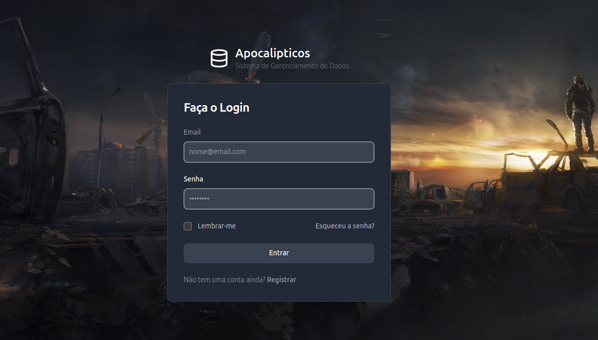
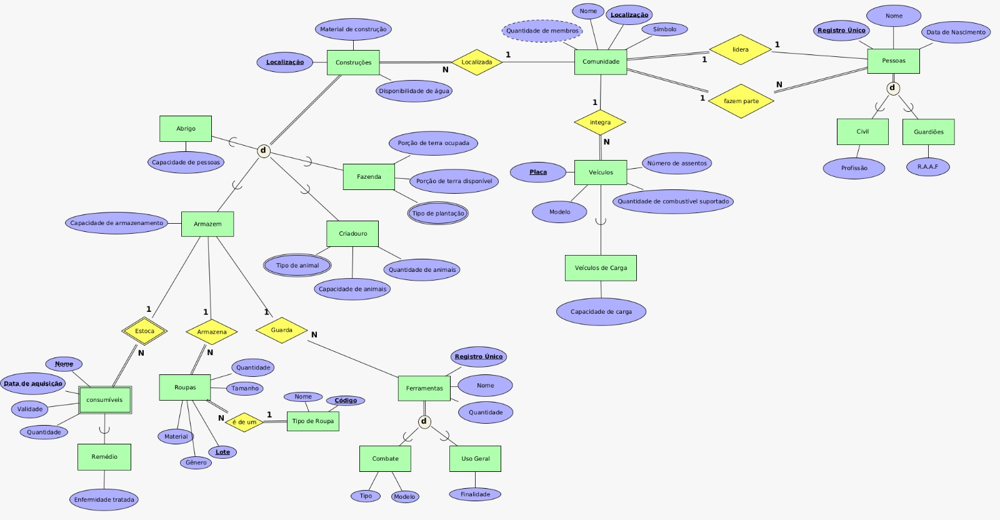

<h1 align="center" style="font-weight: bold;"> ☢️ Apocalypse DB Manager ☢️ </h1>

<p align="center">
  <a href="#">
    
  </a>
  <a href="#">
    
  </a> 
  <a href="#">
    
  </a> 
  <a href="#">
    
  </a> 
  <a href="#">
    
  </a>  
  <a href="#">
    
  </a>  
</p>

<p align="center">
 <a href="#description">Description</a> • 
 <a href="#started">Getting Started</a> • 
 <a href="#running">Running the application</a> • 
  <a href="#routes">App Routes</a> • 
  <a href="#colab">Collaborators</a> •
</p>

<p align="center">
    
</p>

<h2 id="description">📝 Description</h2>

This project is a resource management system developed for a post-apocalyptic scenario, created as part of the Database course in the Computer Science program. The main focus of the project is the implementation and manipulation of the database using PostgreSQL, but it also includes the creation of a complete system with front-end and back-end.

### The Extended Entity-Relationship (EER)

<p align="center">
    
</p>

<h2 id="started"> 🏁 Getting Started</h2>

Before running the application, it is recommended to have some technologies on your machine that will be listed in the following subtopic.

<h3>➜ Prerequisites</h3>

- [Node.js](https://nodejs.org/en)
- [VS Code](https://code.visualstudio.com/)
- [Git](https://git-scm.com/)
- [PostgreSQL](https://www.postgresql.org/)
- [Vue - Official](https://marketplace.visualstudio.com/items?itemName=Vue.volar) (VS Code Extension)

---
With the machine ready, the next steps will be to clone the repository, configure the necessary packages and start the application

<h3>➜ Cloning</h3>

Inside the folder/directory you want to have the application open bash and type the following commands

```bash
git init
```

```bash
git clone https://github.com/Cecote/Apocalypse_DataBase_Manager.git
```

<h3>➜ Configuring</h3>

Now with the repository cloned on your machine, navigate to the "Client" directory and use "npm install" to install the packages necessary to run the application

```bash
cd Apocalypse_Client/
```

```bash
cd Client/
```

```bash
npm install
```

Now, leaving the project root directory again, it will be necessary to do a similar procedure in the server module's app directory as shown below

```bash
cd Apocalypse_Server/
```

```bash
cd app/
```

```bash
npm install
```
<h3>➜ Create DataBase</h3>

After having installed all the necessary packages for the application to function, the next steps will be to create the database, create the database tables and populate the tables with a few data in order to simulate a system that was already in progress.
 
To streamline this process, we have provided a file (on directory "Apocalypse_Script_DataBase") containing an SQL script for creating all the necessary tables required for the application to function properly. In addition to creating the tables, the file also includes a script to populate the created tables with a small set of generic data, in case you prefer not to manually enter each piece of data.

- Firstly, create your postgresql database (if you don't know how to do this, I suggest you search for a tutorial on YouTube).

- Secondly, within your newly created database, run the script mentioned above. 

- Lastly, go to the ".env" file inside the server module following the following path: `Apocalypse_Server/app/.env`. Fill in the necessary information regarding the port on which you intend to run the server and your postgres database to make the connection between it and the application.

At the moment, if you have followed all the steps so far without any problems, both the bank and the application are ready to be started.

<h2 id="running"> 🚀 Starting the application</h2>

First navigate to the server directory and start it.

```bash
cd Apocalypse_Server/
```

```bash
cd app/
```

```bash
npm start
```

Now open a second terminal and navigate to the client directory and launch it.

```bash
cd Apocalypse_Client/
```

```bash
cd Client/
```

```bash
npm run dev
```

Once this is done, the application is now working. Now, open the browser and access the url where the application is running (it will probably be something like http://localhost:<port_number>/ ) and you will land on the login page. Click on the "entrar" button and you will access the system's home page.

<h2 id="routes"> 📍 Application routes</h2>

| route               | description                                          
|----------------------|-----------------------------------------------------
| <kbd>/home</kbd>     | page that lists all the application's features
| <kbd>/pessoas</kbd>     | page that lists all the people registered in the system as well as some relevant information about each of them
| <kbd>/veiculos</kbd>     | page that lists all vehicles registered in the system as well as some relevant information about each one of them
| <kbd>/construcoes</kbd>     | page that lists all the buildings registered in the system as well as some relevant information about each of them
| <kbd>/consumiveis</kbd>     | page that lists all consumables registered in the system as well as some relevant information about each of them
| <kbd>/roupas</kbd>     | page that lists all the clothes registered in the system as well as some relevant information about each one of them
| <kbd>/ferramentas</kbd>     | page that lists all the tools registered in the system as well as some relevant information about each of them
| <kbd>/pessoas/update/<person_id></kbd>     | page that changes a person's data based on their ID
| <kbd>/pessoas/add</kbd>     | page to add new people to the system

<h2 id="colab">🤝 Collaborators</h2>

- [Ana Laura Mendes](https://github.com/a-mendes)
- [Eder Bragança](https://github.com/EderBraganca)
- [Luísa Calegari](https://github.com/lsclgr)
- [Mateus Hamade](https://github.com/mateus-hamade)
- [Selio Guilherme](https://github.com/Guilherme1258)
- [Thiago Cecote](https://github.com/Cecote)